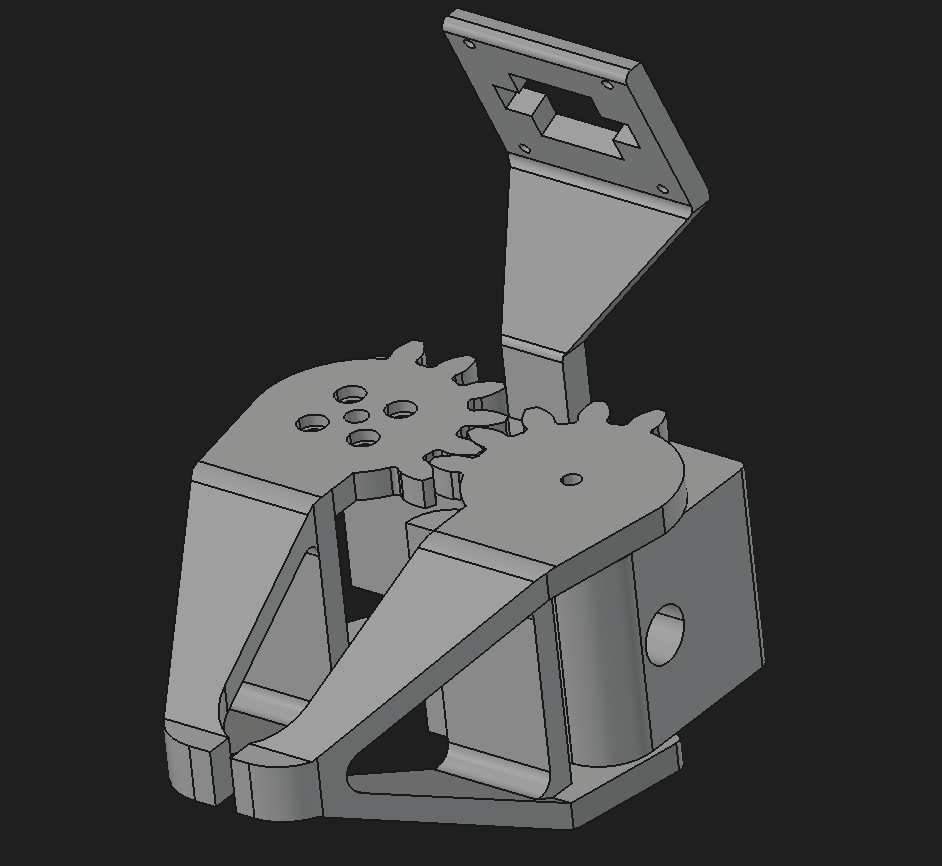
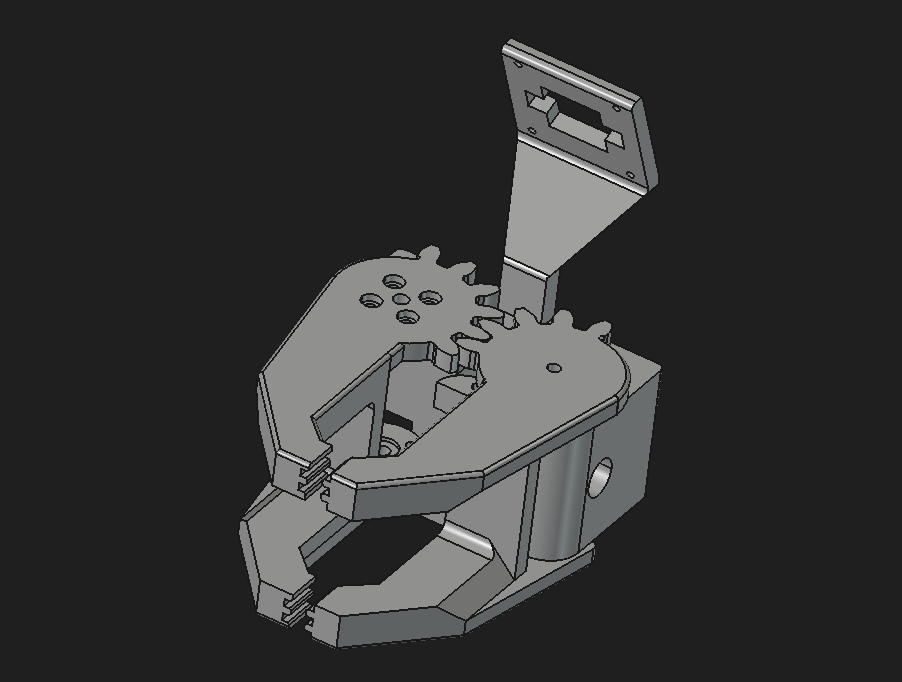
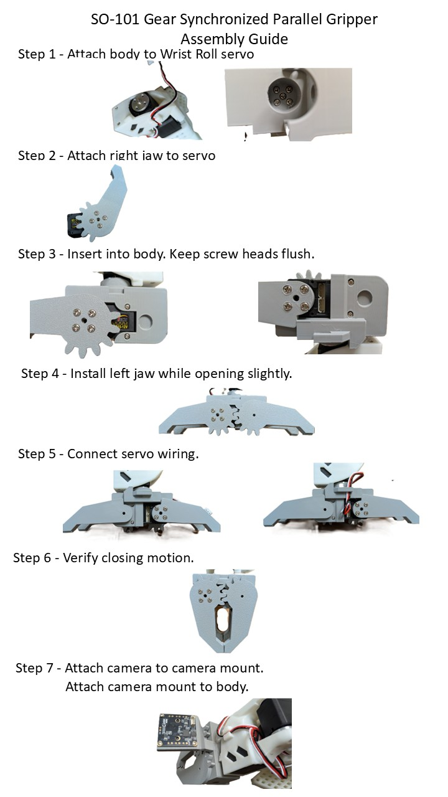

# SO-101 Gear Synchronized Parallel Gripper

Open-source gear synchronized parallel gripper for the SO-101 robotic arm.

## Features

* Gear synchronized jaws
* Single-servo actuation
* Parallel motion
* Centered gripping
* Integrated jaw and gear design
* 3D printable
* Optional wrist camera mount

## Available Designs
### Single Finger

### Two Finger

## Assembly Guide

## Included CAD Files

### STEP

* assembly.step : complete assembly
* body.step : main gripper body
* left_jaw.step : left jaw with integrated gear
* right_jaw.step : right jaw with integrated gear
* camera_mount.step : camera mount

### STL

* body.stl : main gripper body
* left_jaw.stl : left jaw with integrated gear
* right_jaw.stl : right jaw with integrated gear
* camera_mount.stl : camera mount

## Printing

Recommended settings:

* Layer height: 0.2 mm
* Material: PLA or PETG
* Infill: 20–30%
* Supports: Tree Supports Required

### Important

The jaw components contain integrated gear geometry and overhangs.

Tree supports are strongly recommended.

Normal supports can be difficult to remove and may damage the gear teeth or leave marks on functional surfaces.

## License

MIT

## Support

If this project helped your robotics work, you can support future development here:

https://ko-fi.com/neoaxissystems

⭐ If you build one, I'd love to see your results.
